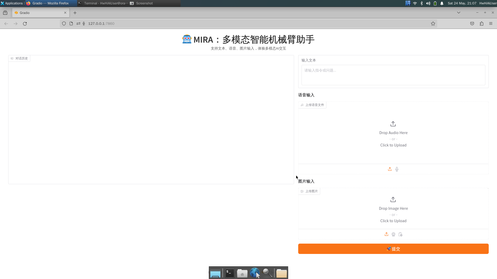
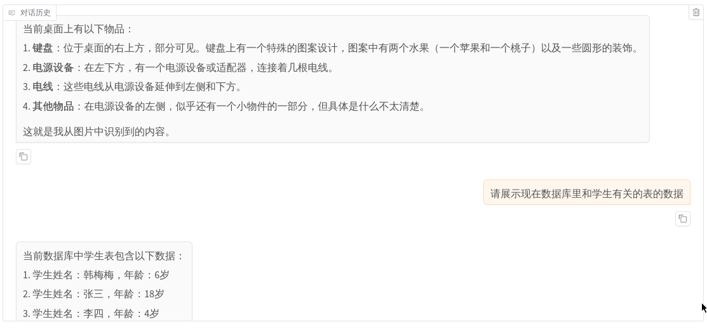
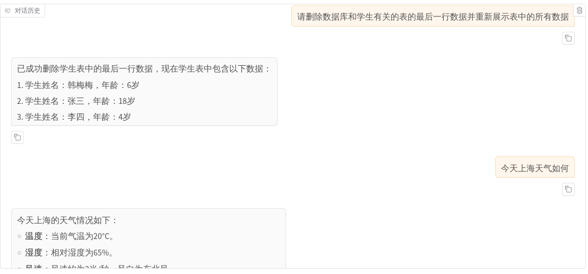
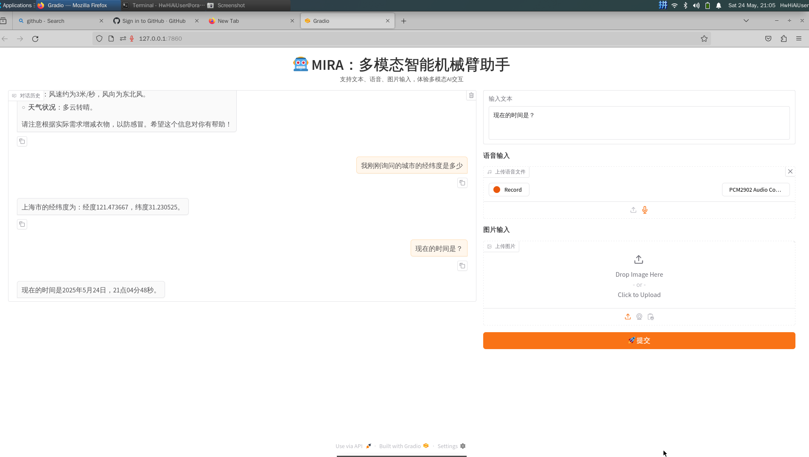

# MIRA: 基于多模态LLM的智能辅助机械臂助手

## 项目介绍
本项目是我在人工智能交互技术AI1101课程上的大作业，我投入了约20小时完成，主要功能如下：
- **多模态交互**：利用Gradio搭建的网页界面，可以用语音、文字和图片提问，MIRA用文字和语音回答，并对于涉及机械臂操作的问题给出正确响应，支持多轮对话和上下文记忆
- **LLM理解指令**：将多模态输入初步处理，由Qwen LLM（qwen-plus）进行理解并自行调用对应工具类，实现查询时间、天气、位置、操作本地SQLite数据库、操作机械臂、调用QwenVL 模型进行图像理解等
- **丰富外设反馈**：在通过网页文字回复的同时，利用音箱提供语音输出，并通过串口与micro：bit通信以提供视觉和声音效果
- **Qwen Agent框架**：使用Qwen Agent框架编写Function Calling和MCP，避免了冗长复杂的Prompt编写和不确定性，提高正确调用对应工具的概率


## 使用举例
如下图片展示了用户语音和文本输入时，MIRA的回复，更加详细的演示过程可以参考：example_show/演示视频.mp4




## 环境准备
硬件环境：香橙派AIPro20T(Ubuntu 22.04)，声卡，音箱，麦克风，相机，JAKA机械臂，microbit v2
软件配置：使用miniconda创建环境，并安装依赖包
1. 克隆仓库
```
git clone https://github.com/johnnyhank/MIRA-Multimodal-Intelligent-Robotic-Assistant.git
```
2. 安装系统依赖
```
sudo apt update
sudo xargs apt install -y < system_packages.txt
```
3. 创建虚拟环境
```
conda create -n mira python=3.10.9
```
4. 激活环境
```
conda activate mira
```
5. 安装依赖包
```
pip install -r requirements.txt
```
**注意：**如果环境有问题，请参考**其余目录说明**中的两份参考文档进行配置
## 使用方式
注意，如果要调用机械臂吸取相关程序，请先按照模块简介中有关标定程序的步骤进行标定，否则机械臂可能无法正确吸取物体。
### 基于Function calling集成的Qwen Agent
1. 使用搭建的gradio页面（支持语音和图像输入）
```
cd 05-samrt-robot
python webui_qwen.py
```
2. 使用Qwen Agent提供的WebUI
```
cd 05-samrt-robot
python utils_qwen_agent.py
```
### 基于Prompt的Json生成方式调用外部函数的LLM Agent
```
cd 05-samrt-robot
python gradio_app.py
```
## 模块简介

### 05-samrt-robot: 基于多模态LLM的智能辅助机械臂助手
* API_Key_utils.py：保存所有的API Key
* calib_bd1127.py：计算仿射变换矩阵
* calib_cam_point.py：获取相机标定点的坐标
* calib_grip_test.py：测试机械臂吸取功能
* calib_robot_point.py：获取机械臂标定点的坐标
* gradio_app.py：提供基于Prompt的Json生成方式调用外部函数的LLM Agent的WebUI
* start.py：提供基于Prompt的Json生成方式调用外部函数的LLM Agent的命令行运行
* utils_agent.py：定义智能体 Agent 的编排逻辑，根据Prompt生成 JSON 格式的动作列表，并提供示例模板。
* utils_cam.py：提供相机相关功能，如打开摄像头实时预览、拍照并保存图像。
* utils_llm.py：提供大语言模型（LLM）相关功能，包括时间、天气查询以及与高德地图的接口。
* utils_micro_bit.py：提供与 micro:bit 设备通信的功能，包括连接设备、发送数据和断开连接。
* utils_onnx_yolo.py：实现基于 ONNX 模型的目标检测功能，用于识别图像中的物体并返回其中心点坐标。
* utils_qwen_agent.py：使用Qwen Agent框架开发agent，定义多个自定义工具类，实现与机械臂、micro:bit 和视觉模型的交互。
* utils_robot.py：提供机械臂的基本操作函数，如初始化、移动到指定位置和执行问候动作。
* utils_spe_rec.py：提供语音识别功能，包括录音和使用百度语音识别 API 将音频转换为文本。
* utils_tts.py：提供文本转语音功能，使用 Edge TTS 合成语音并播放。
* utils_vlm.py：提供视觉语言模型（VLM）相关的功能，使用通义千问 VL 模型进行图像识别。
* utils_vlm_move.py：结合视觉识别和机械臂控制，实现根据图像识别结果抓取特定物体的功能。
* webui_qwen.py：基于 Gradio 的 Web 用户界面，支持多模态输入（文本、语音、图片），并与 Qwen Agent 集成，提供更直观的交互体验。

#### 标定程序
由于相机的位置不一定固定，因此需要进行标定（本仓库代码使用的是九点标定），大致流程和涉及到的Python脚本如下：
1. 获取九点在相机坐标系下的坐标
    ```
    python 05-samrt-robot/calib_cam_point.py
    ```
    在弹出的窗口中，将标定点按顺序点击，并记录九点在相机坐标系下的坐标。
2. 获取九点机械臂坐标系下的坐标
   ```
   python 05-samrt-robot/calib_robot_point.py
   ```
    按住FREE将机械臂依次移动到九点对应位置，再按POINT键，记录九点在机械臂坐标系下的坐标。（注意相机坐标系和机械臂坐标系中九点的顺序需要一一对应）
3. 计算仿射变换矩阵
   ```
    python 05-samrt-robot/calib_bd1127.py
    ```
    记录打印的仿射变换矩阵，并将utils_vlm_move.py中的relation_matrix替换为计算得到的仿射变换矩阵。

### 其余目录说明
本项目是在https://gitee.com/myronx/OrangePi-SIC 的基础上改进的，其余模块基本未作修改
* 00-starter-pack: 配置模块，香橙派启动自动播报IP地址

* 01-voice-interaction：语音交互模块，语音识别与语音合成

* 02-erniebot：基于Ernie Bot的大语言模块

* 03-yolo-om-infer：视觉模块，YOLO检测模型

* 04-jaka-minicobo：机械臂模块，操纵节卡机械臂
  * 04.get_tcppos.py 可以用于获取吸取的物体的对应坐标

香橙派参考文档请见：https://notes.sjtu.edu.cn/s/iL4X6eLvz
节卡单臂机器人操作手册：https://notes.sjtu.edu.cn/s/qtKNPFdBT

## 致谢与感悟
在本项目开发过程中，我衷心感谢以下个人和团队的支持与帮助（不分先后）：

感谢 AI1101的教师楚朋志、谢铭烨 的悉心指导与宝贵建议。
感谢 AI1101课程的所有材料、https://gitee.com/myronx/OrangePi-SIC 与开源社区提供的相关工具和框架，为本项目提供了坚实的技术支持。
感谢 提供相关API的平台：
百度AIP（https://cloud.baidu.com/）
文心一言（https://aistudio.baidu.com/overview）
通义千问（https://help.aliyun.com/zh/model-studio/first-api-call-to-qwen）
心知天气（https://www.seniverse.com/）
高德地图（https://lbs.amap.com/dev/id/newuser）

此外，在项目的开发过程中，我也收获了许多宝贵的经验与思考：

1. 多模态交互的设计需要兼顾用户体验和技术实现。
2. 机械臂控制与视觉识别的结合对精度要求较高，需要进行坐标系的转换，而标定过程是关键环节之一。
3. Qwen Agent框架的的搭建与使用，使得所有的工具都以同样的方式可以被使用。事实上，我一开始使用的是https://gitee.com/myronx/OrangePi-SIC 中通过Prompt调用函数的方法，但是这种Prompt生成Json再解析函数的调用方式比较繁琐且容易出现错误，因此，我决定使用Qwen Agent框架进行重构，使得所有的工具都以同样的方式可以被使用。

未来，希望 MIRA 能够不断完善，为更多场景提供智能化服务！
